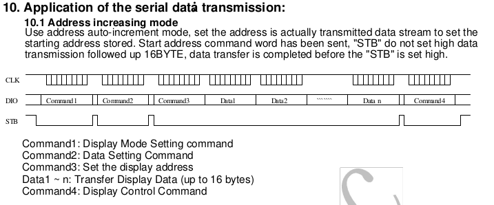

# XibTM1638 Library

This library allows you to use the TM1638 board in an easier way. You can see different uses examples in the "examples" folder.

This board contains three elements. From top to bottom:
- Eight red leds
- Eight 7 segment displays
- Eight buttons.

This board have three pins to connect to your Arduino or compatible.
- Strobe
- Data Input/Output
- Clock

# Explaning commands

The way to use this board is by sending specific commands. Already done in the library, this explanation is to modify my library or to write your own library. You can see the datasheet PDF included.

First, put the three pins as OUTPUT in the setup, because the board is always expecting to receive information.

```
void setup(){
    pinMode(STROBE, OUTPUT);
    pinMode(CLOCK,  OUTPUT);
    pinMode(DATA,   OUTPUT);
}
```
To send a simple command, first set STROBE to LOW, use the function "shiftOut" with parameters STROBE, CLOCK, LSBFIRST, VALUE (your command). Finally set STROBE to HIGH.

```
digitalWrite(STROBE, LOW);
shiftOut(STROBE, CLOCK, LSBFIRST, 0x00);
digitalWrite(STROBE, HIGH);
```
Depends on the command, you have to close the command (set STROBE to HIGH) immediately or you must send some extra commmands before.

There are three main commands. Each command is composed of half a byte and an extra info to complete the byte.

## First half:

|Binary|Hex|Meaning|
|---|---|---|
|0100|4|Data command set|
|1000|8|Display control command set|
|1100|c|Address command set|

## Second half - Data command set:

|Binary|Hex|Meaning|
|---|---|---|
|0000|0|Address increasing mode|
|0010|2|Read the buttons|
|0100|4|Fixed address|

## Second half - Display control command set

First bit means display on or off. Three next bits means (with display on) the brightness intensity.

|Binary|Hex|Meaning|
|---|---|---|
|0000|0|Turn off the display|
|1???|?|Turn on the display with ??? brightness|
|1001|9|Turn on the display with 001 brightness|
|1101|d|Turn on the display with 101 brightness|

## Second half - Address command set

Display or led number to use.

|Binary|Hex|Meaning|
|---|---|---|
|0000|0|Display 1|
|0001|1|Led 1|
|0010|2|Display 2|
|0011|3|Led 2|
|etc|etc|etc|
|1110|e|Display 8|
|1111|f|Led 8|

## Extra byte - Address command set
To turn on/off the leds and set info in the displays you need to send an extra byte.

|Binary|Thing|Result|
|---|---|---|
|00000000|Led|Turn off|
|00000001|Led|Turn on red|
|00000010|Led|Turn on green|
|00000011|Led|Turn on red and green|
|00000000|Display|Turn off all segments|
|00000001|Display|Turn on A|
|00000010|Display|Turn on B|
|00000100|Display|Turn on C|
|00100010|Display|Turn on B and F|
|HGFEDCBA|Display|Each bit what represents|

## To sum up

These are the possible combinations of a complete byte command

|0100 Data command set|1000 Display control command set|1100 Address command set|
|---|---|---|
|0000 Address increasing mode|0000 Turn off the display|0000 Display 1|
|0010 Read the buttons|1??? Turn on the display with ??? brightness|0001 Led 1|
|0100 Fixed address||0010 Display 2|
|||ETC|
|||Plus value byte|

## Examples

The datasheet give you some examples to use the board. Here you can see these examples written as code. It's important to notice when set STROBE HIGH or LOW in every command. The "command 1" of the pictures is usually used only one time in the setup(). Use "Data command set + (fixed or auto)" and "Address command set" and the data byte. Or "Data command set + read button".

### Address increasing mode



As you can see, there are four commands, and some data info (up to 16 bytes).

```
//---Command 1 - Display control command set + on/off/brightness
digitalWrite(STROBE, LOW);

//0x89 / 8 is 1000 - Display control command set / 9 is 1001 - Display on, minimun brightness
shiftOut(DATA, CLOCK, LSBFIRST, 0x89);

digitalWrite(STROBE, HIGH);

/***/

//---Command 2 - Data command set + Address increasing mode
digitalWrite(STROBE, LOW);

//0x40 / 4 is 0100 - Data command set / 0 is 0000 - Address increasing mode
shiftOut(DATA, CLOCK, LSBFIRST, 0x40);

digitalWrite(STROBE, HIGH);

/***/

//---Command 3 - Address command set + Led or display address
digitalWrite(STROBE, LOW);

//0xc0 / c is 1100 - Address command set / 0 is 0000 - Display number 1. 0001 would be led number 1, 0010 display number 2 etc.
shiftOut(DATA, CLOCK, LSBFIRST, 0xc0);

//Turn on "a" in display number 1
shiftOut(DATA, CLOCK, LSBFIRST, 0x01);
//Turn on led number 1
shiftOut(DATA, CLOCK, LSBFIRST, 0x01);
//Turn off display number 2
shiftOut(DATA, CLOCK, LSBFIRST, 0x00);
//Turn on led number 2
shiftOut(DATA, CLOCK, LSBFIRST, 0x01);
//Turn on "a, b, c, d, e, f, g, h" in display number 2
shiftOut(DATA, CLOCK, LSBFIRST, 0xff);
//ETC

digitalWrite(STROBE, HIGH);

/***/

//---Command 4 -  Display control command set + on/off/brightness
//Not neccesary if you want to keep your display on. Same as Command 1.

```


### Fixed address mode


```

//---Command 1 - Display control command set + on/off/brightness
digitalWrite(STROBE, LOW);

//0x89 / 8 is 1000 - Display control command set / 9 is 1001 - Display on, minimun brightness
shiftOut(DATA, CLOCK, LSBFIRST, 0x89);

digitalWrite(STROBE, HIGH);

/***/

//---Command 2 - Data command set + Fixed address mode
digitalWrite(STROBE, LOW);

//0x40 / 4 is 0100 - Data command set / 4 is 0100 - Fixed address mode
shiftOut(DATA, CLOCK, LSBFIRST, 0x44);

digitalWrite(STROBE, HIGH);

/***/

//---Command 3 - Address command set + Led or display address
digitalWrite(STROBE, LOW);

//0xc0 / c is 1100 - Address command set / 0 is 0000 - Display number 1. 0001 would be led number 1, 0010 display number 2 etc.
shiftOut(DATA, CLOCK, LSBFIRST, 0xc0);

//Turn on "a, e, f, g, h" in display number 1
shiftOut(DATA, CLOCK, LSBFIRST, 0xf1);

digitalWrite(STROBE, HIGH);

/***/

//---Command 4 - Address command set + Led or display address
digitalWrite(STROBE, LOW);

//0xc0 / c is 1100 - Address command set / 0 is 0000 - Display number 1. 0001 would be led number 1, 0010 display number 2 etc.
shiftOut(DATA, CLOCK, LSBFIRST, 0xc1);

//Turn on led number 1
shiftOut(DATA, CLOCK, LSBFIRST, 0x01);

digitalWrite(STROBE, HIGH);

/***/

//---Command 5 -  Display control command set + on/off/brightness
//Not neccesary if you want to keep your display on. Same as Command 1.

```

## Read buttons


```
//var to save the values from the buttons, each bit is a button
uint8_t buttons = 0;

digitalWrite(STROBE, LOW);
//0x42 / 4 is 0100 - Data command set / 2 is 0010 - Read buttons
shiftOut(DATA, CLOCK, LSBFIRST, 0x42);

//Data as input to receive the bytes
pinMode(DATA, INPUT);

//The board send 4 bytes,
for (uint8_t i = 0; i < 4; i++)
{
    //Read bytes and shift one position on every iteration
    uint8_t v = shiftIn(DATA, CLOCK, LSBFIRST) << i;
    //Put together in one var
    buttons |= v;
}

//Data as output to send more data when needed
pinMode(DATA, OUTPUT);
digitalWrite(STROBE, HIGH);

```

Read buttons is a bit tricky, that code works, but i'm going to explain what is happening inside the for.

The board have eight buttons ordered like that |1|2|3|4|5|6|7|8|. It could have more, but my board have only eight, that's important.

The board send four bytes, each bit is a button, but I only have eight, so, there are a lot of bits "not used" in this example. If you see every byte and start to press each button, you would see the positions of each one. Taking the positions of buttons of before.

(I'm representing the positions of each button from numbers before, every number in reality its a 0 or 1, it's binary of course)

Byte 1: 0 0 0 5 0 0 0 1  
Byte 2: 0 0 0 6 0 0 0 2  
Byte 3: 0 0 0 7 0 0 0 3  
Byte 4: 0 0 0 8 0 0 0 4  

The code above put together all bits in only one var. Bits are moved one position each iteration and added (logic or) in a byte var.

Byte 1: 0 0 0 5 0 0 0 1  
Byte 2: 0 0 6 0 0 0 2 0  
Byte 3: 0 7 0 0 0 3 0 0  
Byte 4: 8 0 0 0 4 0 0 0 

Final byte: 8 7 6 5 4 3 2 1

So, if you want to see if button 3 is pressed or not, you can see the bit 3 from this final byte with readBit(x, n) for example.

Another solution could be separate every button in its own var. You know the positions, so, from first byte get the bit 1 and put in a var, get the bit 4 and put in another var, second byte and do the same, etc.

```

//array to save the values from the buttons, each byte is a button
//size 8 because I know how many buttons I want to read
uint8_t buttons[8];

digitalWrite(STROBE, LOW);
//0x42 / 4 is 0100 - Data command set / 2 is 0010 - Read buttons
shiftOut(DATA, CLOCK, LSBFIRST, 0x42);

//Data as input to receive the bytes
pinMode(DATA, INPUT);

//The board send 4 bytes,
for (uint8_t i = 0; i < 4; i++)
{
    //Read bytes save to a var
    uint8_t v = shiftIn(DATA, CLOCK, LSBFIRST);
    
    //Read the positions I know there are the info and save it
    buttons[i] = bitRead(v, 0);
    buttons[i + 4] = bitRead(v, 4);
}

//Data as output to send more data when needed
pinMode(DATA, OUTPUT);
digitalWrite(STROBE, HIGH);

```

